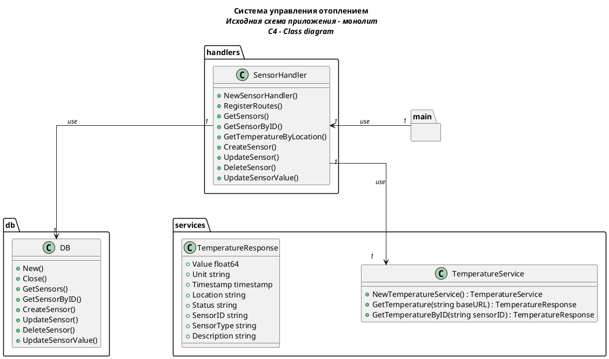

```puml
@startuml source

<style>
arrow {
    FontName Arial
    FontSize 12
    FontStyle italic
    FontColor black
}
</style>

skinparam linetype ortho
skinparam nodesep 150
skinparam ranksep 100
skinparam sequenceMessageAlign center

title
    <b>Система управления отоплением</b>
    <i> Исходная схема приложения - монолит</i>
    <i> C4 - Class diagram </i>
end title

namespace db {
    class DB {
        + New()
        + Close()
        + GetSensors()
        + GetSensorByID()
        + CreateSensor()
        + UpdateSensor()
        + DeleteSensor()
        + UpdateSensorValue()
    }
}

namespace handlers {
    class SensorHandler {
        + NewSensorHandler()
        + RegisterRoutes()
        + GetSensors()
        + GetSensorByID()
        + GetTemperatureByLocation()
        + CreateSensor()
        + UpdateSensor()
        + DeleteSensor()
        + UpdateSensorValue()
    }
}

namespace services {
    class TemperatureService {
        + NewTemperatureService() : TemperatureService
        + GetTemperature(string baseURL) : TemperatureResponse
        + GetTemperatureByID(string sensorID) : TemperatureResponse
    }

    class TemperatureResponse {
        + Value float64
        + Unit string
        + Timestamp timestamp
        + Location string
        + Status string
        + SensorID string
        + SensorType string
        + Description string
    }
}

namespace main {
}

SensorHandler "1" -d-> "1" DB : use
SensorHandler "1" -d-> "1" TemperatureService : use
main "1" -l-> "1" SensorHandler : use


@enduml
```